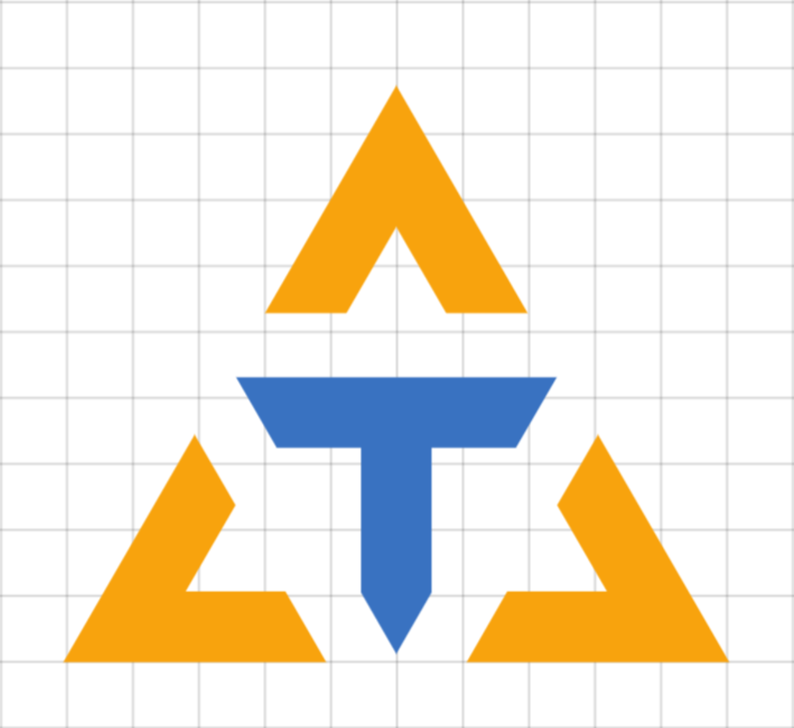

<p align="center">
  <a href="" rel="noopener">
 </a>
</p>

<h3 align="center">The Talos Project - Talos One</h3>

<div align="center">

  []() 
  [](/LICENSE)

</div>

---

<p align="center"> Open Source Drone Control
    <br> 
</p>

## 📝 Table of Contents
- [About](#about)
- [Getting Started](#getting_started)
- [Deployment](#deployment)
- [Usage](#usage)
- [Built Using](#built_using)
- [TODO](doc/TODO.md)
- [Contributing](../CONTRIBUTING.md)
- [Authors](#authors)
- [Acknowledgments](#acknowledgement)

## 🧐 About <a name = "about"></a>
> And Talos, the man of bronze, as he broke off rocks from the hard cliff, stayed them from fastening hawsers to the shore, when they came to the road-stead of Dicte’s haven. He was of the stock of bronze, of the men sprung from ash-trees, the last left among the sons of the gods; and the son of Cronos gave him to Europa to be the warder of Crete and to stride round the island thrice a day with his feet of bronze.
> 
> ~ The Argonautica Book IV, Apollonius Rhodius

## 🏁 Getting Started <a name = "getting_started"></a>
These instructions will get you a copy of the project up and running on your local machine for development and testing purposes. See [deployment](#deployment) for notes on how to deploy the project on a live system.

### Prerequisites
What things you need to install the software and how to install them.

```
Give examples
```

### Installing
A step by step series of examples that tell you how to get a development env running.

Say what the step will be

```
Give the example
```

And repeat

```
until finished
```

End with an example of getting some data out of the system or using it for a little demo.


## 🎈 Usage <a name="usage"></a>
Add notes about how to use the system.

## 🚀 Deployment <a name = "deployment"></a>
Add additional notes about how to deploy this on a live system.

## ⛏️ Built Using <a name = "built_using"></a>
- [ROS](https://www.ros.org/) - Operating System

## ✍️ Authors <a name = "authors"></a>
- [@sondreo](https://github.com/sondreo) - founder
- [@sandbergo](https://github.com/sandbergo) - founder

## 🎉 Acknowledgements <a name = "acknowledgement"></a>
- Kyleobo
